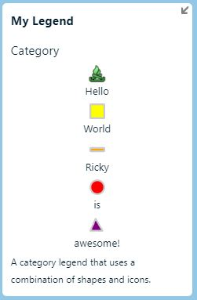
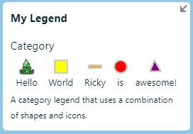
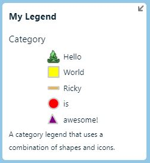
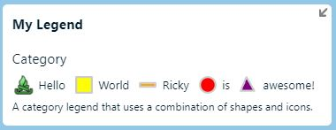
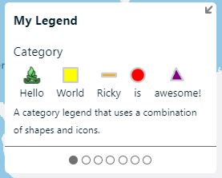
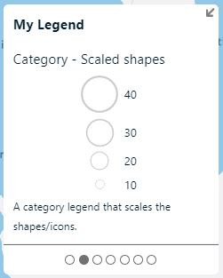
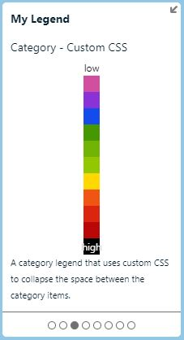

# Category legend examples

The following are some examples of using the category legend type.

The category has two layout options. The first `layout` option specifies how all the categories items are laid out relatively. The second `itemLayout` specifies how a single item is lays out its shape and label. Both of these options have the same set of possible values: `'row'`, `'row-reverse'`, `'column'`, and `'column-reverse'`. The following table shows how these two layout options can be used to customize how a category legend is laid out.

<table style="text-align:center">
    <tr>
        <td></td>
        <td></td>
        <td colspan="2">`layout`</td>
    </tr>
    <tr>
        <td></td>
        <td></td>
        <td>`'column'`</td>
        <td> `'row'`</td>
    </tr>
    <tr>
        <td rowspan="2">`itemLayout`</td>
        <td>`'column'`</td>
        <td></td>
        <td></td>
    </tr>
    <tr>
        <td> `'row'`</td>
        <td></td>
        <td></td>
    </tr>
</table>

## Standard category legend

Use the built in shapes with colors or specify an image URL or inline SVG string.

```javascript
{
    type: 'category',
    subtitle: 'Category',
    layout: 'row',
    itemLayout: 'column',
    footer: 'A category legend that uses a combination of shapes and icons.',
    strokeWidth: 2,
    items: [
        {
            color: 'DodgerBlue',
            label: 'label1',

            //Url to an image.
            shape: 'https://azuremapscodesamples.azurewebsites.net/Common/images/icons/campfire.png'
        }, {
            color: 'Yellow',
            label: 'label2',
            shape: 'square'
        }, {
            color: 'Orange',
            label: 'Ricky',
            shape: 'line'
        }, {
            color: 'Red',
            label: 'is',
            shape: 'circle'
        }, {
            color: 'purple',
            label: 'awesome!',
            shape: 'triangle'
        }
    ]
}
```

The above category legend type options will generate a legend that looks like the following.



## Scaled shapes category legend

```javascript
{
    type: 'category',
    subtitle: 'Category - Scaled shapes',
    cssClass: 'centerItems',
    layout: 'column-reverse',
    itemLayout: 'row',
    shape: 'circle',
    color: 'transparent',
    footer: 'A category legend that scales the shapes/icons.',

    //Setting fitItems to true will allow all shapes to be equally spaced out and centered.
    fitItems: true,

    //Set the shape size for each item.
    items: [
        {
            label: '10',
            shapeSize: 10
        }, {
            label: '20',
            shapeSize: 20
        }, {
            label: '30',
            shapeSize: 30
        }, {
            label: '40',
            shapeSize: 40
        }
    ]
}
```

The above category legend type options will generate a legend that looks like the following.



## Custom CSS category legend

Passing in a CSS class to customize how the legend is rendered.

```javascript
{
    type: 'category',
    subtitle: 'Category - Custom CSS',
    layout: 'column',
    itemLayout: 'column',
    shape: 'square',
    
    //Pass in a CSS class the 
    cssClass: 'collapsedCategory',

    //Have the labels overlap the shape. Otherwise the text span size may push the shape away from the other shapes.
    labelsOverlapShapes: true,

    //Optionally remove the stroke around the shapes.
    strokeWidth: 0,
    footer: 'A category legend that uses custom CSS to collapse the space between the category items.',
    items: [
        {
            label: 'low',
            color: 'white',

            //Ensure the label will always appear when overlaid on top of the item. 
            cssClass: 'darkText'
        },
        {
            color: '#d24fa0'
        },
        {
            color: '#8a32d7'
        },
        {
            color: '#144bed'
        },
        {
            color: '#479702'
        },
        {
            color: '#72b403'
        },
        {
            color: '#93c701'
        },
        {
            color: '#ffd701'
        },
        {
            color: '#f05514'
        },
        {
            color: '#dc250e'
        },
        {
            color: '#ba0808'
        },
        {
            label: 'high',
            color: 'black',

            //Ensure the label will always appear when overlaid on top of the item. 
            cssClass: 'lightText'
        }
    ]
}
```

The above category legend type options will generate a legend that looks like the following.



## Next steps

- [Category legend type interface](legend_control.md#categorylegendtype-interface)
- [Category legend item interface](legend_control.md#categorylegenditem-interface)