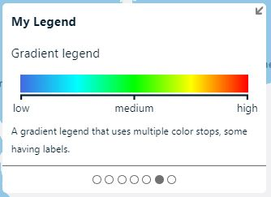
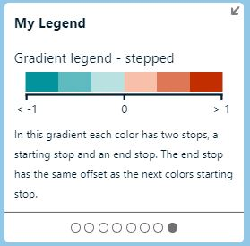

# Gradient legend examples

The following are some examples of using the gradient legend type.

## Standard gradient legend

The following gradient legend options creates a horizontal gradient with multiple colors, some of which have labels that are added at specific points.

```javascript
{
    type: 'gradient',
    subtitle: 'Gradient legend',
    footer: 'A gradient legend that uses multiple color stops, some having labels.',

    stops: [
        {
            offset: 0,
            color: 'royalblue',
            label: 'low'
        },
        {
            offset: 0.25,
            color: 'cyan'
        },
        {
            offset: 0.5,
            color: 'lime',
            label: 'medium'
        }, 
        {
            offset: 0.75,
            color: 'yellow'
        },{
            offset: 1,
            color: 'red',
            label: 'high'
        }
    ]
}
```

The above gradient legend type options will generate a legend that looks like the following.



### Gradient legend with transparency

The gradient bar in the legend has a checker pattern underneath. If any of the color stops in the gradient options have transparency, it will be honored and the checker pattern behind will show through. The following gradient legend options creates a vertical gradient, with a short bar length, that transitions from a transparent color to a solid color.

```javascript
{
    type: 'gradient',
    subtitle: 'Gradient legend - transparency',
    footer: 'A gradient legend that has transparency.',
    orientation: 'vertical',
    barLength: 75,
    stops: [
        {
            offset: 0,
            color: 'rgba(0,0,0,0)',
            label: 'Transparent'
        },{
            offset: 1,
            color: 'black',
            label: 'Solid'
        }
    ]
}
```

The above gradient legend type options will generate a legend that looks like the following.


## Stepped gradient legend

A stepped gradient can be created by adding two stops for each color stop, a starting stop and an end stop. The end stop has the same offset as the next colors starting stop.

```javascript
{
    type: 'gradient',
    subtitle: 'Gradient legend - stepped',
    footer: 'In this gradient each color has two stops, a starting stop and an end stop. The end stop has the same offset as the next colors starting stop.',
    stops: [
        {
            offset: 0,
            color: '#03939c',
            label: '< -1'
        }, {
            offset: 0.167,
            color: '#03939c'
        }, {
            offset: 0.167,
            color: '#5ebabf'
        }, {
            offset: 0.334,
            color: '#5ebabf'
        }, {
            offset: 0.334,
            color: '#bae1e2'
        }, {
            offset: 0.501,
            color: '#bae1e2'
        }, {
            offset: 0.501,
            color: '#f8c0aa',
            label: '0'
        }, {
            offset: 0.668,
            color: '#f8c0aa'
        }, {
            offset: 0.668,
            color: '#dd7755'
        }, {
            offset: 0.835,
            color: '#dd7755'
        }, {
            offset: 0.835,
            color: '#c22e00'
        }, {
            offset: 1,
            color: '#c22e00',
            label: '> 1'
        },
    ]
}
```

The above gradient legend type options will generate a legend that looks like the following.



## Next steps

- [Gradient legend type interface](legend_control.md#gradientlegendtype-interface)
- [Gradient color type interface](legend_control.md#colortype-interface)
