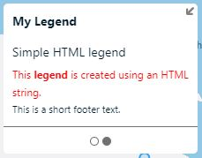

# HTML legend examples

A legend that can be created using custom HTML.

## Create a simple HTML legend

An HTML legend can be created using an HTML string, or by passing in an DOM element. The following options create a simple HTML legend using an HTML string.

```javascript
 {
    type: 'html',
    subtitle: 'Simple HTML legend',
    html: '<span class="simple-legend">This <b>legend</b> is created using an <i>HTML</i> string.</span>'
}
```

The above HTML legend type options will generate a legend that looks like the following.



## Create a chart legend using a 3rd party library

This example uses [Char.js](https://www.chartjs.org/) to create a rich chart and adds it as a legend card within a legend control.

First load the 3rd party library into your page.

```HTML
<!-- Load any 3rd party libraries desired. In this case Chart.js -->
<script src="https://cdn.jsdelivr.net/npm/chart.js@3.5.1/dist/chart.min.js"></script>
```

When using Chart.js, the canvas element must be added to the page DOM before creating the chart. To ensure success, create a canvas element, add it to the legend control, add the legend control the map, then use Chart.js to render a chart on the canvas.

```javascript
//Create a canvas element to use with chart.js
var chartCanvas = document.createElement('canvas');
chartCanvas.height = 200;
chartCanvas.width = 200;
chartCanvas.style.padding = '10px';

//Add the legend control to the map.
var legend = new atlas.control.LegendControl({
    title: 'My Legend',
    legends: [{
        type: 'html',
        subtitle: 'Chart.js HTML legend',
        footer: 'This chart was created by adding a Canvas element to the legend and using <a href="https://www.chartjs.org/" target="_blank">Chart.js</a> to create a chart on the canvas.',
        html: chartCanvas
    }]
});

//Add the legend to the map.
map.controls.add(legend, {
    position: 'bottom-left'
});

//Chart.js requires the canvas to be added to the page DOM before drawing a chart. Thus, run chart.js code after Legend control/canvas has been added to the map.
var myChart = new Chart(chartCanvas.getContext('2d'), {
    type: 'radar',
    data: {
        labels: [
            'Eating',
            'Drinking',
            'Sleeping',
            'Designing',
            'Coding',
            'Cycling',
            'Running'
        ],
        datasets: [{
            label: 'My First Dataset',
            data: [65, 59, 90, 81, 56, 55, 40],
            fill: true,
            backgroundColor: 'rgba(255, 99, 132, 0.2)',
            borderColor: 'rgb(255, 99, 132)',
            pointBackgroundColor: 'rgb(255, 99, 132)',
            pointBorderColor: '#fff',
            pointHoverBackgroundColor: '#fff',
            pointHoverBorderColor: 'rgb(255, 99, 132)'
        }, {
            label: 'My Second Dataset',
            data: [28, 48, 40, 19, 96, 27, 100],
            fill: true,
            backgroundColor: 'rgba(54, 162, 235, 0.2)',
            borderColor: 'rgb(54, 162, 235)',
            pointBackgroundColor: 'rgb(54, 162, 235)',
            pointBorderColor: '#fff',
            pointHoverBackgroundColor: '#fff',
            pointHoverBorderColor: 'rgb(54, 162, 235)'
        }]
    }
});
```

The above HTML legend type options will generate a legend that looks like the following.


## Next steps

- [HTML legend type interface](legend_control.md#htmllegendtype-interface)
