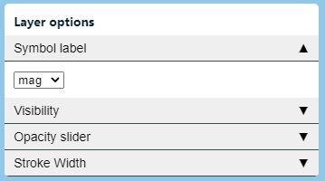
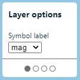
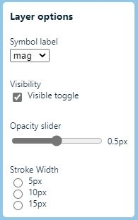

# Layer Control

The layer control allows you to easily create a control panel of options that directly effect how layers are rendered on the map.

The layer control has a `layout` option that specifies how multiple layer group cards are displayed. There are three different types of layouts.

| Layer group layout | Description | Example |
|--------------------|-------------|---------|
| `'accordion'` | Adds each item or group as an accordion panel. |  |
| `'carousel'` | Allows the user to page through each item. |  |
| `'list'` | Adds items one after another vertically. |  |

The layer control can have one or more `LayerGroups`. Layer groups define a set of controls that change the style of a set of associated layers. There are four different types of layer group layouts.

| Layer group layout | Description |
|--------------------|-------------|
| `'checkbox'` | Displays the list of layer states within a layer group as check boxes. |
| `'dropdown'` | Displays the list of layer states within a layer group as a dropdown. |
| `'radio'` | Displays the list of layer states within a layer group as radio buttons. |
| `'range'` | Displays the list of layer states within a layer group as range sliders. |

## Implementation

The following is an example that creates a layer control that contains a single layer group of radio buttons. When a radio button is selected, the style of the layers in the layer group will be updated.

```javascript
//Create the layer control.
var layerControl = new atlas.control.LayerControl({
    title: 'My layer control',

    //Specify the layer groups for the control. 
    layerGroups: [
        //A radio button layer group options. 
        {
            layout: 'radio',

            //A title for this layer group.
            groupTitle: 'Stroke Width',
            
            //The layers affected by this group. 
            layers: ['earthquake-circles'],

            //The layer group states.
            items: [{
                    label: '5px',

                    //Style to apply when a radio item is selected.
                    enabledStyle: {
                        strokeWidth: 5
                    }
                },
                {
                    label: '10px',

                    //Style to apply when a radio item is selected.
                    enabledStyle: {
                        strokeWidth: 10
                    }
                },
                {
                    label: '15px',

                    //Style to apply when a radio item is selected.
                    enabledStyle: {
                        strokeWidth: 15
                    }
                }
            ]
        }
    ]
});

//Add the layer control to the map. 
map.controls.add(layerControl, {
    position: 'top-right'
});

//Optionally add events to the layer control to know when any states change.
map.events.add('statechanged', layerControl, function(e){
    console.log('statechanged');
});
```

## API Reference

API reference for the classes and interfaces related to the Layer control.

### Layer control

**Namespace:** `atlas.control`

A control for creating a list of layers and actions.

**Constructor**

> `LayerControl(options?: LayerControlOptions)`

**Methods** 

| Name | Return Value | Description |
|------|--------------|-------------|
| `getOptions()` | `LayerControlOptions` | Gets the options of the layer control. |
| `setOptions(options?: LayerControlOptions)` | | Sets the style of the layer control. |

**Events**

| Name | Return Value | Description |
|------|--------------|-------------|
| `statechanged` | `LayerStateChangedEventArgs` | Event fired when a state changes. |
| `toggled` | `ControlToggledEventArgs` | Event fired when the control is minimized or expanded. |

### LayerControlOptions interface

Layer control options.

**Properties** 

| Name | Value | Description |
|------|-------|-------------|
| `container` | `string` \| `HTMLElement` | The ID of an element or HTMLElement instances to append the legend control to. If not defined, legend will be displayed within the map area. |
| `layerGroups` | `LayerGroup[]` | One or more groups of layers and states. |
| `layout` | `'accordion'` \| `'carousel'` \| `'list'` | How multiple items are laid out.<br/> - `'accordion'` adds each item or group as an accordion panel.<br/> - `'carousel'` allows the user to page through each item.<br/> - `'list'` adds items one after another vertically.<br/>Default: `'list'` |
| `legendControl` | `atlas.control.LegendControl` | A legend control to display the layer state legends in. |
| `minimized` | `boolean` | When displayed within the map, specifies if the controls content is minimized or not. Only used when `showToggle` is `true`. Default: `false` |
| `resx` | `Record<string, string>` | Resource strings. |
| `showToggle` | `boolean` | Specifies if a toggle button for minimizing the controls content should be displayed or not when the control within the map. Default: `true` |
| `style` | `atlas.ControlStyle` \| `'auto-reverse'` \| `string` | The style of the control. Can be `'light'`, `'dark'`, `'auto'`, `'auto-reverse'`, or any CSS3 color string. Default: `'light'` |
| `title` | `string` | The top level title of the layer control. |
| `visible` | `boolean` | Specifies if the overview map control is visible or not. Default: `true` |
| `zoomRangeBehavior` | `'disable`' \| `'hide'` | Specifies how a layer group or state should be treated when the map zoom level falls outside of the items min and max zoom range. Default: `'disable'` |

### LayerGroup interface

A group of layer items.

**Properties** 

| Name | Value | Description |
|------|-------|-------------|
| `groupTitle` | `string` | The title of the layer group. |
| `items` | `(RangeLayerState \| LayerState)[]` | The states of the layer. |
| `layers` | `(string \| atlas.layer.Layer)[]` | One or more layers that are impacted by the layer state. |
| `layout` | `'dropdown'` \| `'checkbox'` \| `'radio'` \| `'range'` | How the layer state items are presented. Default: `'checkbox'` |
| `legends` | `LegendType[]` | One or more legends to display for the layer group. These legends only hide based on zoom level. |
| `maxZoom` | `number` | Max zoom level that this layer group should appear. Default: `24` |
| `minZoom` | `number` | Min zoom level that this layer group should appear.  Default: `0` |

### LayerState interface

Applies to `dropdown`, `checkbox` and `radio` layout types.

States that define style options to be applied to layers when they are enabled/disabled.

**Properties** 

| Name | Value | Description |
|------|-------|-------------|
| `disabledStyle` | `any` | Style options to apply to layer when state is disabled. |
| `enabled` | `boolean` | A boolean indicating if the layer state is enabled or disabled. Default: `false` |
| `enabledStyle` | `any` | Style options to apply to layer when state is enabled. |
| `inflateStyles` | `boolean` | Specifies if color and opacity styles replicated with other layer types that don't have an equivalent style defined. This allows a single style to be used across different types of layers. For example, for a polygon layer, `"color"` would map to `"fillColor"`. Default: `false` |
| `label` | `string` | The title of the layer state to display. |
| `layers` | `(string \| atlas.layer.Layer)[]` | One or more layers that are impacted by the layer state. |
| `legends` | `LegendType[]` | One or more legends to display when this state is enabled. These legends will be hidden when state is disabled, or based on zoom level range. |
| `maxZoom` | `number` | Max zoom level that this state should appear. Default: `24` |
| `minZoom` | `number` | Min zoom level that this state should appear.  Default: `0` |

### RangeLayerState interface

Applies to `range` layout type.

States for an input range that defines style options to be applied to layers when a range slider changes.

**Properties** 

| Name | Value | Description |
|------|-------|-------------|
| `inflateStyles` | `boolean` | Specifies if color and opacity styles replicated with other layer types that don't have an equivalent style defined. This allows a single style to be used across different types of layers. For example, for a polygon layer, `"color"` would map to `"fillColor"`. Default: `false` |
| `label` | `string` | The title of the layer state to display. Default: `'{rangeValue}'` |
| `layers` | `(string \| atlas.layer.Layer)[]` | One or more layers that are impacted by the layer state. |
| `legends` | `LegendType[]` | One or more legends to display when this state is enabled. These legends will be hidden when state is disabled, or based on zoom level range. |
| `max` | `number` | The maximum value of the range input. Default: `1` |
| `maxZoom` | `number` | Max zoom level that this state should appear. Default: `24` |
| `min` | `number` | The minimum value of the range input. Default: `0` |
| `minZoom` | `number` | Min zoom level that this state should appear.  Default: `0` |
| `numberFormat` | `Intl.NumberFormatOptions` | The number formatting to apply to the value when displaying it in the label. |
| `step` | `number` | The incremental step value of the range input. Default: `0.1` |
| `style` | `any` | Style options to apply to layer when state changes. Use a placeholder of '{rangeValue}' in your expression. This will be replaced with the value from the range. |
| `updateOnInput` | `boolean` | Specifies if the style should be updated when the `oninput` event fires (while sliding). Warning, this can trigger multiple updates in a very short period of time. Default: `false` |
| `value` | `number` | The initial value of the range input. Default: `1` |

### LayerStateChangedEventArgs interface

Event args returned when a layer state changes.

**Properties** 

| Name | Value | Description |
|------|-------|-------------|
| `layerGroup` | `LayerGroup` | The layer group the state changed on. |
| `newState` | `RangeLayerState` \| `LayerState` | The new state. |
| `oldState` | `LayerState` | The old state. Only returned when the layout is `dropdown` or `radio`. |
| `type` | `'statechanged'` | The event type name. |

## ControlToggledEventArgs interface

Event args returned when a legend is focused.

**Properties** 

| Name | Value | Description |
|------|-------|-------------|
| `minimized` | `boolean` | Specifies if the control is minified or not. |
| `type` | `'toggled'` | The event type name. |
