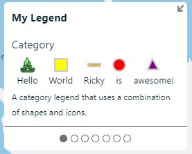

# Legend Control

A control that displays legend information on the map.

The legend control has a `layout` option that specifies how multiple legend cards are displayed. There are three different types of layouts.

| Legend layout | Description | Example |
|---------------|-------------|---------|
| `'accordion'` | Adds each item or group as an accordion panel. |  |
| `'carousel'` | Allows the user to page through each item. |  |
| `'list'` | Adds items one after another vertically. |  |

Legends have a specific legend `type`. There are four different legend types.

| Legend type | Description | Example |
|-------------|-------------|---------|
| `category` | Displays a list of items that are categorized. |  |
| `gradient` | Displays a color gradient with optional labelled points. |  |
| `html` | Displays a custom HTML elements. |  |
| `image` | Displays an image as a legend. |  |

See the following examples for the different legend types.

- [Category legend examples](category_legend_examples.md)
- [Gradient legend examples](gradient_legend_examples.md)
- [HTML legend examples](html_legend_examples.md)
- [Image legend examples](image_legend_examples.md)
- [Dynamic legends](dynamic_legends.md)

## Implementation

The following code creates a legend control with two legend cards. By default the legend control will display this with a `carousel` layout.

```javascript
//Add the custom control to the map.
var legend = new atlas.control.LegendControl({
    //Global title to display for the legend.
    title: 'My Legend',
    
    //All legend cards to display within the legend control.
    legends: [
    
        //A category legend that uses a combination of shapes and icons.
        {
            type: 'category',
            subtitle: 'Category',
            layout: 'row',
            itemLayout: 'column',
            strokeWidth: 2,
            items: [
                {
                    color: 'Yellow',
                    label: 'label2',
                    shape: 'square'
                }, {
                    color: 'Orange',
                    label: 'Ricky',
                    shape: 'line'
                }, {
                    color: 'Red',
                    label: 'is',
                    shape: 'circle'
                }, {
                    color: 'purple',
                    label: 'awesome!',
                    shape: 'triangle'
                }
            ]
        },

        //A category legend that scales the shapes/icons.
        {
            type: 'category',
            subtitle: 'Category - Scaled shapes',
            layout: 'column-reverse',
            itemLayout: 'row',
            shape: 'circle',
            color: 'transparent',
            footer: 'A category legend that scales the shapes/icons.',

            //Setting fitItems to true will allow all shapes to be equally spaced out and centered.
            fitItems: true,

            //Set the shape size for each item.
            items: [
                {
                    label: '10',
                    shapeSize: 10
                }, {
                    label: '20',
                    shapeSize: 20
                }, {
                    label: '30',
                    shapeSize: 30
                }, {
                    label: '40',
                    shapeSize: 40
                }
            ]
        }
    ]
});

//Add the legend control to the map.
map.controls.add(legend, {
    position: 'bottom-left'
});                

//Optionally add events to the legend control to know when the focused legend card changes.
map.events.add('legendfocused', legend, function(e){
    console.log('legendfocused ' + e.legendIdx);
});
```

## API Reference

API reference for the classes and interfaces related to the Legend control.

### Layer control

**Namespace:** `atlas.control`

A control that displays legend information on the map.

**Constructor**

> `LegendControl(options?: LegendControlOptions)`

**Methods** 

| Name | Return Value | Description |
|------|--------------|-------------|
| `add(legend: LegendType, show: boolean)` | | Adds a legend to the legend control. If the legend is already in the control, it will update the carousel index to focus on this legend. |
| `focus(legend: LegendType)` | | Puts the specified legend in view of the user. If in carousel mode, will switch to that legend. |
| `getOptions()` | `LegendControlOptions` | Gets the options of the layer control. |
| `remove(legend: LegendType)` | | Removes a legend from the legend control. |
| `setLegendIdx(idx: number, focus?: boolean)` | | Navigates to the specified legend index within a carousel or list. |
| `setOptions(options?: LegendControlOptions)` | | Sets the style of the layer control. |

**Events**

| Name | Return Value | Description |
|------|--------------|-------------|
| `statechanged` | `LegendFocusEventArgs` | Event that fires when a legend is programmatically focused. |
| `toggled` | `ControlToggledEventArgs` | Event fired when the control is minimized or expanded. |

### LegendControlOptions interface

Options for a legend control.

**Properties** 

| Name | Value | Description |
|------|-------|-------------|
| `container` | `string | HTMLElement` | The ID of an element or HTMLElement instances to append the legend control to. If not defined, legend will be displayed within the map area. |
| `layout` | `'accordion'` \| `'carousel'` \| `'list'` | How multiple items are laid out.<br/>- `'accordion'` adds each item or group as an accordion panel.<br/>- `'carousel`' allows the user to page through each item.<br/>- `'list'` adds items one after another vertically. Default: `'carousel'` |
| `legends` | `LegendType[]` | The type of legend to generate. |
| `minimized` | `boolean` | When displayed within the map, specifies if the controls content is minimized or not. Only used when `showToggle` is `true`. Default: `false` |
| `resx` | `Record<string, string>` | Resource strings. |
| `showToggle` | `boolean` | Specifies if a toggle button for minimizing the controls content should be displayed or not when the control within the map. Default: `true` |
| `style` | `atlas.ControlStyle` \| `'auto-reverse'` \| `string` | The style of the control. Can be `'light'`, `'dark'`, `'auto'`, `'auto-reverse'`, or any CSS3 color string. Default: `'light'` |
| `title` | `string` | The top level title of the legend control. |
| `visible` | `boolean` | Specifies if the overview map control is visible or not. Default: `true` |
| `zoomBehavior` | `'disable'` \| `'hide'` | Specifies how all legend cards should be treated when the map zoom level falls outside of the items min and max zoom range. Can be overridden at the legend type setting level. Default: `'hide'` |

### LegendType interface

Base legend type that all other legend types inherit from.

**Properties** 

| Name | Value | Description |
|------|-------|-------------|
| `type` | `'category'` \| `'image'` \| `'html'` \| `'gradient'` | **Required.** The type of legend to create. |
| `cssClass` | `string` | A CSS class to append to the legend type container. |
| `footer` | `string` | Text to be added at the bottom of the legend. |
| `maxZoom` | `number` | Max zoom level that this legend should appear. Default: `24` |
| `minZoom` | `number` | Min zoom level that this legend should appear.  Default: `0` |
| `subtitle` | `string` | The title for this specific legend. |
| `zoomBehavior` | `'disable'` \| `'hide'` | Specifies how a legend card should be treated when the map zoom level falls outside of the items min and max zoom range. Default: `'hide'` |

### CategoryLegendType interface

**Extends:** `LegendType` interface

Category legend type options.

**Properties** 

| Name | Value | Description |
|------|-------|-------------|
| `type` | `'category'` | **Required.** The type of legend. |
| `items` | `CategoryLegendItem[]` | **Required.** The category items. |
| `collapse` | `boolean` | Specifies if space around the shapes should be collapsed so that items are close together. Default: `false` |
| `color` | `string` | The fill color of SVG items in all category items. |
| `fitItems` | `boolean` | Specifies if all items should be fit into the largest container created by an item. Default: `false` |
| `itemLayout` | `'row'` \| `'row-reverse'` \| `'column'` \| `'column-reverse'` | How the color swatch and label of each item are laid out. Overrides the CSS `flex-direction` style. Default: `'row'` |
| `labelsOverlapShapes` | `boolean` | Specifies if the text label should overlap the shapes. When set to `true`, the position of the label span will be set to `absolute`. Default: `false`  |
| `layout` | `'row'` \| `'row-reverse'` \| `'column'` \| `'column-reverse'` | How all items are laid out. Overrides the CSS `flex-direction` style. Default: `'column'` |
| `numberFormat` | `Intl.NumberFormatOptions` | The number format options to use when converting a number label to a string. |
| `numberFormatLocales` | `string` \| `string[]` | The number format locales to use when converting a number label to a string. |
| `shape` | `'circle'` \| `'triangle'` \| `'square'` \| `'line'` \| `string` | The shape of the color swatches of all items. Supports image urls and SVG strings. Default: `'circle'` |
| `shapeSize` | `number` | The size of the all shapes in pixels. Used to scale the width of the shape. Default: `20` |
| `strokeWidth` | `number` | The thickness of the stroke on SVG shapes in pixels. Default: `1` |

### CategoryLegendItem interface

Category legend item options.

**Properties** 

| Name | Value | Description |
|------|-------|-------------|
| `color` | `string` | The color of the individual category item. Overrides `CategoryLegendType` level `color`. Default: `'transparent'` |
| `cssClass` | `string` | A CSS class added to an individual item. |
| `label` | `string` \| `number` | The label to display for the item. |
| `shape` | `'circle'` \| `'triangle'` \| `'square'` \| `'line'` \| `string` | The shape of the color swatch. Overrides the top level shape setting for this individual item. Supports image urls and SVG strings. |
| `shapeSize` | `number` | The size of the individual shape in pixels. Used to scale the width of the shape. Overrides `CategoryLegendType` level `shapeSize`. Default: `20` |
| `strokeWidth` | `number` | The thickness of the stroke on SVG shapes in pixels. Overrides `CategoryLegendType` level `strokeWidth`. Default: `1` |

### ImageLegendType interface

**Extends:** `LegendType` interface

A simple legend where the content is an image.

**Properties** 

| Name | Value | Description |
|------|-------|-------------|
| `type` | `'image'` | **Required.** The type of legend. |
| `url` | `string` | **Required.** A URL, or inline SVG string for the legend content. |
| `altText` | `string` | **Recommended.** Accessibility description of the legend image. Falls back to `subtitle` if not specified. |
| `maxHeight` | `number` | Max height of the image. |
| `maxWidth` | `number` | Max width of the image. |

### HtmlLegendType interface

**Extends:** `LegendType` interface

A legend where custom HTML is set as the content.

**Properties** 

| Name | Value | Description |
|------|-------|-------------|
| `type` | `'html'` | **Required.** The type of legend. |
| `html` | `string` \| `HTMLElement` | **Required.** HTML legend content. |

### GradientLegendType interface

**Extends:** `LegendType` interface

A legend where custom HTML is set as the content.

**Properties** 

| Name | Value | Description |
|------|-------|-------------|
| `type` | `'gradient'` | **Required.** The type of legend. |
| `stops` | `ColorStop[]` | **Required.** The color stops that form the gradient. |
| `barLength` | `number` | The length of the gradient bar in pixels. Default: `256` |
| `barThickness` | `number` | How thick the gradient bar should be in pixels. Default: `20` |
| `fontFamily` | `string` | The font family used for labels. Default: `"'Segoe UI', Roboto, 'Helvetica Neue', Arial, 'Noto Sans', sans-serif"` |
| `fontSize` | `number` | The font size used for labels. Default: `12` |
| `numberFormat` | `Intl.NumberFormatOptions` | The number format options to use when converting a number label to a string. |
| `numberFormatLocales` | `string` \| `string[]` | The number format locales to use when converting a number label to a string. |
| `orientation` | `'vertical'` \| `'horizontal'` | The orientation of the legend. Default: `'horizontal'` |
| `tickSize` | `number` | The length of line ticks for each label. Default: `5` |

### ColorStop interface

Color stop used for gradients and steps.

**Properties** 

| Name | Value | Description |
|------|-------|-------------|
| `color` | `string` | **Required.** The color to apply at the stop. |
| `offset` | `number` | **Required.** The offset to add the color to the gradient. 0.0 is the offset at one end of the gradient, 1.0 is the offset at the other end. |
| `label` | `string` \| `number` | A label to display at this stop. |

### DynamicLegendType interface

**Extends:** `LegendType` interface

A legend that dynamically generated from a layers style. See [Dynamic legends](dynamic_legends.md) for more details.

**Properties** 

| Name | Value | Description |
|------|-------|-------------|
| `type` | `'dynamic'` | **Required.** The type of legend to create. |
| `layer` | `string` \| `azmaps.layer.Layer` | **Required.** The layer to generate the legend(s) for. |
| `cssClass` | `string` | A CSS class added to all legend cards. |
| `defaultCategory` | `CategoryDefaults` | Default options to apply to category legends. |
| `defaultImage` | `ImageDefaults` | Default options for image legends. |
| `defaultGradient` | `GradientDefaults` | Default options for gradient legends. |
| `subtitleFallback` | `'auto'` \| `'expression'` \| `'none'` \| `string` | Specifies how subtitles should be set if not explicitly set in the legend type.<br/> - `'auto'` - Looks at the layers metadata for the following properties, in this order `'title'`,  `'subtitle'`. Falls back to the layers ID.<br/> - `'expression'` - If a style expression has a simple `get` expression such as `['get', 'revenue']` the property name will be extracted and set as the subtitle of the legend card. Falls back to the layers ID.<br/> - `'none'` - No subtitle value is added to the legend.<br/> - `string` - The name of a property in the layers metadata to use as the subtitle.<br/>Falls back to the layers ID unless set to `'none'`.<br/>Default: `'auto'` |
| `footerFallback` | `'auto'` \| `'none'` \| `string` | Specifies how footer should be set if not explicitly set in the legend type.<br/> - `'auto'` - Looks at the layers metadata for the following properties, in this order `'footer'`,  `'description'`, `'abstract'`<br/> - `'none'` - No footer value is added to the legend.<br/> - `string` - The name of a property in the layers metadata to use as the footer.<br/> Default: `'auto'` |

### CategoryDefaults interface

A subset of category legend options to use as default settings for any dynamically generated legend that is rendered as a category legend.

**Properties** 

| Name | Value | Description |
|------|-------|-------------|
| `color` | `string` | The fill color of SVG items in all category items. |
| `cssClass` | `string` | A CSS class added to an individual item. |
| `fitItems` | `boolean` | Specifies if all items should be fit into the largest container created by an item. Default: `false` |
| `itemLayout` | `'row'` \| `'row-reverse'` \| `'column'` \| `'column-reverse'` | How the color swatch and label of each item are laid out. Overrides the CSS `flex-direction` style. Default: `'row'` |
| `labelsOverlapShapes` | `boolean` | Specifies if the text label should overlap the shapes. When set to `true`, the position of the label span will be set to `absolute`. Default: `false`  |
| `layout` | `'row'` \| `'row-reverse'` \| `'column'` \| `'column-reverse'` | How all items are laid out. Overrides the CSS `flex-direction` style. Default: `'column'` |
| `numberFormat` | `Intl.NumberFormatOptions` | The number format options to use when converting a number label to a string. |
| `numberFormatLocales` | `string` \| `string[]` | The number format locales to use when converting a number label to a string. |
| `shape` | `'circle'` \| `'triangle'` \| `'square'` \| `'line'` \| `string` | The shape of the color swatches of all items. Supports image urls and SVG strings. Default: `'circle'` |
| `shapeSize` | `number` | The size of the all shapes in pixels. Used to scale the width of the shape. Default: `20` |
| `strokeWidth` | `number` | The thickness of the stroke on SVG shapes in pixels. Default: `1` |

### ImageDefaults interface

A subset of image legend options to use as default settings for any dynamically generated legend that is rendered as a image legend.

**Properties** 

| Name | Value | Description |
|------|-------|-------------|
| `maxHeight` | `number` | Max height of the image. |
| `maxWidth` | `number` | Max width of the image. |

### GradientDefaults interface

A subset of gradient legend options to use as default settings for any dynamically generated legend that is rendered as a gradient legend.

**Properties** 

| Name | Value | Description |
|------|-------|-------------|
| `barLength` | `number` | The length of the gradient bar in pixels. Default: `256` |
| `barThickness` | `number` | How thick the gradient bar should be in pixels. Default: `20` |
| `fontFamily` | `string` | The font family used for labels. Default: `"'Segoe UI', Roboto, 'Helvetica Neue', Arial, 'Noto Sans', sans-serif"` |
| `fontSize` | `number` | The font size used for labels. Default: `12` |
| `numberFormat` | `Intl.NumberFormatOptions` | The number format options to use when converting a number label to a string. |
| `numberFormatLocales` | `string` \| `string[]` | The number format locales to use when converting a number label to a string. |
| `orientation` | `'vertical'` \| `'horizontal'` | The orientation of the legend. Default: `'horizontal'` |
| `tickSize` | `number` | The length of line ticks for each label. Default: `5` |

### LegendFocusEventArgs interface

Event args returned when a legend is focused.

**Properties** 

| Name | Value | Description |
|------|-------|-------------|
| `legend` | `LegendType` | The legend that is focused. |
| `legendIdx` | `number` | The index of the legend in the array of legends in the legend control options. |
| `type` | `'legendfocused'` | The event type name. |

## ControlToggledEventArgs interface

Event args returned when a legend is focused.

**Properties** 

| Name | Value | Description |
|------|-------|-------------|
| `minimized` | `boolean` | Specifies if the control is minified or not. |
| `type` | `'toggled'` | The event type name. |
